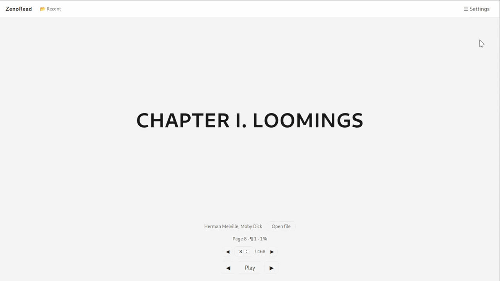

<div align="center">

<picture>
<source media="(prefers-color-scheme: dark)" srcset="src/assets/main-borderless-logo.svg">

</picture>

# ZenoRead

A local-first speed reading app built on **RSVP** (*Rapid Serial Visual Presentation*). Text is segmented and shown one block at a time in a fixed, centered area at a controlled speed (WPM), eliminating unnecessary eye movements (or saccades).

<br />


</div>

## Features

- **RSVP speed reading** of local `.txt` and `.pdf` files at a chosen words per minute (WPM) rate and punctuation pause durations
- **Reading progress saved per document**: reopening a document resumes exactly where it was last seen.
- **Configurable RSVP behavior**: customize how text is split into reading blocks to personalize the experience.
- **PDF page navigation**: jump between paragraph blocks within pages.

Plus themes (light/dark), font tuning, and keyboard shortcuts for navigation and pause/resume.

## Status

ZenoRead is in active development. The core speed-reading experience works on Windows, Linux and Android. The UI and settings still have rough edges (e.g. settings sidebar needs scroll support for smaller screens, side panels don't dismiss on outside tap). Packaged installers are not yet available.

## System Requirements

- **Desktop:** Microsoft Edge WebView2 for Windows (Windows 7 requires installing it, Windows 10+ has it by default); WebKitGTK 4.1+ (Linux).
- **Android:** WebView 125+ (required by the PDF parser) and Android 8+. On older Android versions, disable the built-in Chrome (if outdated) and [update WebView through the Play Store](https://play.google.com/store/apps/details?id=com.google.android.webview).

## Limitations

- Language support is scoped to whitespace delimited scripts. The tokenizer splits on whitespace, so it works for Latin-like languages (English, Spanish, and similar). Support for others (Japanese, Chinese, Thai, etc.) is not expected to arrive soon.
- macOS and iOS are not tested (no device to do it) but should work following Tauri's docs and adjusting the specifics for the platforms.
- For now the app behaves as offline-only. Cloud sync in a local-first way is a desirable feature but not implemented yet.

## Roadmap

Not yet built. Planned for future work:

- EPUB support.
- OCR for scanned (image-only) PDFs.
- ORP (Optimal Recognition Point) highlighting.
- Cloud sync (local-first replication with Supabase/CouchDB).

## Getting the app

ZenoRead is not published as a downloadable installer yet. For now, you can run and build it from source (see [Getting Started](#getting-started) below). For the three supported platforms, you can build the app and run it directly. On Android, a signed APK should be built for sideloading (you provide your own signing key; see [Tauri Android docs](https://v2.tauri.app/distribute/sign/android/)).

## Development

### Prerequisites

- **Node.js** 24+
- **PNPM** 11
- **Rust** toolchain via [rustup](https://rust-lang.org/tools/install)
- **Tauri dependencies**: See the [Tauri prerequisites](https://v2.tauri.app/start/prerequisites/) for detailed instructions on what may also be needed to build any Tauri app on your system.

### Getting Started

```sh
pnpm install             # install dependencies
pnpm tauri dev           # run the app as a debug build
pnpm tauri build         # build a release bundle for the current OS
pnpm tauri android dev   # run the app on Android as a debug version
pnpm tauri android build # build a release bundle for Android
```

For more specific distribution options, see the [Tauri distribution guide](https://v2.tauri.app/distribute/).

### Testing

```sh
pnpm test                # unit tests (Vitest)
pnpm test:e2e            # E2E tests (Playwright)
pnpm lint                # linter for Vue and TypeScript (ESLint)
```

### Tech Stack

- **Tauri v2**: Native desktop and mobile shell built with Rust, handling WebView integration and system access.
- **Vue 3 + Vite 8**: Frontend framework using Composition API, TypeScript, Pinia for state management, and vue-i18n for internationalization.
- **RxDB**: Local-first NoSQL database over IndexedDB for local data persistence and reactive state management.
- **Tailwind CSS v4**: Utility-first styling integrated directly with Vite.
- **pdfjs-dist**: Using its legacy version for PDF text extraction.
- **Vitest + Playwright**: Unit, component, and E2E testing framework suite.

### Project Structure

```
src/
  assets/          # main.css, Tailwind theme tokens
  components/      # Vue components (layout, reader, shared UI atoms)
  composables/     # usePlayback, useDragDrop, useKeyboardShortcuts, useErrorBoundary
  db/              # RxDB database init, schemas, migrations
  documents/       # file loading, parsers, streamers, parser registry (txt, pdf)
  i18n/            # vue-i18n catalogs (en, es)
  parsing/         # tokenizer, block segmentation, pause computation
  playback/        # PlaybackController (timer-driven block advance)
  stores/          # Pinia stores (settings, documents, progress, notifications)
  utils/           # errors, logger, platform detection, startup
src-tauri/         # Rust shell (Tauri config, capabilities, Android project, build)
e2e/               # Playwright E2E specs
```

### Data Flow

The general flow of the data can be simplified as:

```
file loading → parsing → streamer → block segmentation → playback → screen
```

A file is loaded from disk (or from a `File` blob in the browser) and handed to the parser for its type (txt or pdf). The parser produces a streamer that yields text on demand per section (a whole document for TXT, one page at a time for PDF). The playback system segments the text into blocks and advances through them on a timer scaled by the user's WPM and specific pauses settings, emitting one block at a time to the centered reading area. For PDFs, page navigation is cross-section navigation: reaching the end of a page auto-advances to the next.
